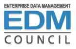

TODO: Update this document, it does not include the builder documentation!

# rdf-toolkit

The `rdf-toolkit` is a command-line 'swiss army knife' tool for reading and writing RDF and OWL files in whatever format.

The primary reason for creating this tool was to have a reference implementation of the toolkit/formatter that 
creates the FIBO ontologies as they are stored in the [Github FIBO repository](https://github.com/edmcouncil/fibo) 
(which is at this point in time still a private repository). However, this tool is not in any way specific to FIBO, 
it can be used with any set of ontologies or for that matter even "normal" RDF files.

It currently uses OWLAPI and RDF4J to do the hard work, see [this page](docs/dependencies.md) for more info about those products.

This will be used in a commit-hook to make sure that all RDF files in the repo are stored in the same way.

See for more information about developing rdf-toolkit [this](docs/develop.md) page or [this page](docs/dependencies.md) for information about dependencies.

# Recommended Output Format

The recommended Output Format at this time is RDF/XML because that is the format that the OMG requires for submissions. 
The EDM Council develops the FIBO Ontologies and submits them as RDF/XML, serialized by the `rdf-toolkit` to the OMG. 
So that is why we also use RDF/XML in Github itself. There are some issues with that and we're working on resolving that, 
by either "fixing" the RDF/XML output generated by OWLAPI or RDF4J, or by eventually migrating to some other format. 
For use in Git we need a format that:

## Requirements for Git-based Ontology Serialization

- As few 'diff-lines' as possible per 'pull request'
- Relative URIs
  - so that Git branch or tag name can become part of the final Ontology Version IRI
  - so that dereferencing from tools like Protege, straight to the github repo would work
- Readable (RDF/XML is only readable by the very few)

# issues

The FIBO JIRA server has a separate project for the rdf-toolkit: https://jira.edmcouncil.org/browse/RDFSER

Please add your issues, bugs, feature requests, requirements or questions as issues on the JIRA site.

# download

Download the RDF Toolkit [here](https://jenkins.edmcouncil.org/job/rdf-toolkit-build/lastSuccessfulBuild/artifact/target/scala-2.11/rdf-toolkit.jar)

# usage

Copy the [rdf-toolkit.jar](https://jenkins.edmcouncil.org/job/rdf-toolkit-build/lastSuccessfulBuild/artifact/target/scala-2.11/rdf-toolkit.jar) file to your local disk.

## Linux or Mac OS X

On Linux or Mac OS X you can execute the rdf-toolkit
as follows:

1. Open a Terminal
2. Type the name of the rdf-toolkit.jar file on the command prompt and supply the --help option:
```
>rdf-toolkit.jar --help
```

## Windows

1. Open a Command Shell by going to the Start menu and type cmd.exe
2. Ensure that Java is installed by typing "java -version" on the command line, which should result in
   either version 1.7 or 1.8.
3. Then launch the rdf-toolkit's help function as follows:
```
C:/>java -jar rdf-toolkit.jar --help
```

# --help

The current "--help" option gives the following information:

```
rdf-toolkit version 1.0.3-SNAPSHOT-6d7165e (2015-04-03T20:59:15.113-0400)

Usage: rdf-toolkit [OPTIONS] output-file input-file(s) ...

OPTIONS

-h
--help                                        show this help

--version                                     show just the version of rdf-toolkit: 1.0.3-SNAPSHOT-6d7165e

-q
-v
--quiet
--verbose                                     Increment (-v, --verbose) or decrement (-q, --quiet) the verbosity level.

-a
--abort                                       Abort on error

-f
--force                                       Force output file to be overwritten if it exists

--api <api>                                   Specify whether you want to use the OWLAPI or Sesame. Default is OWLAPI.

--ofmt <output-format>
--output-format <output-format>               Output formats for OWLAPI are:
                                              - TriX
                                              - OWL Functional Syntax
                                              - OBO Format
                                              - KRSS2 Syntax
                                              - OWL/XML Syntax
                                              - RDF/XML
                                              - RDF/XML Syntax
                                              - RDF/JSON
                                              - N3
                                              - Manchester OWL Syntax
                                              - BinaryRDF
                                              - N-Triples
                                              - JSON-LD
                                              - N-Quads
                                              - TriG
                                              - Turtle
                                              - Turtle Syntax
                                              - LaTeX Syntax
                                              Output formats for Sesame are:
                                              - turtle (sorted Turtle) [default]

--base <base-dir>=<uri>
--base-dir-uri <base-dir>=<uri>
--base-dir-url <base-dir>=<uri>               ... (May be specified multiple times.)

--url-replace <pattern>=<replacement string>  Replace any part of a Subject, Predicate or Object URI that matches with
                                              the given <pattern> with the given <replacement string> (May be specified
                                              multiple times.)

PARAMETERS

output-file    Output file to which to write.

input-file(s)  Input files to read. You can specify multiple input files, but they will then all be merged into one
               output file. (May be specified multiple times.)
```

* [Sesame serializer documentation](docs/SesameRdfFormatter.md)
